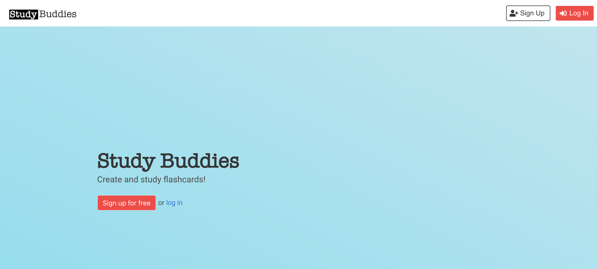
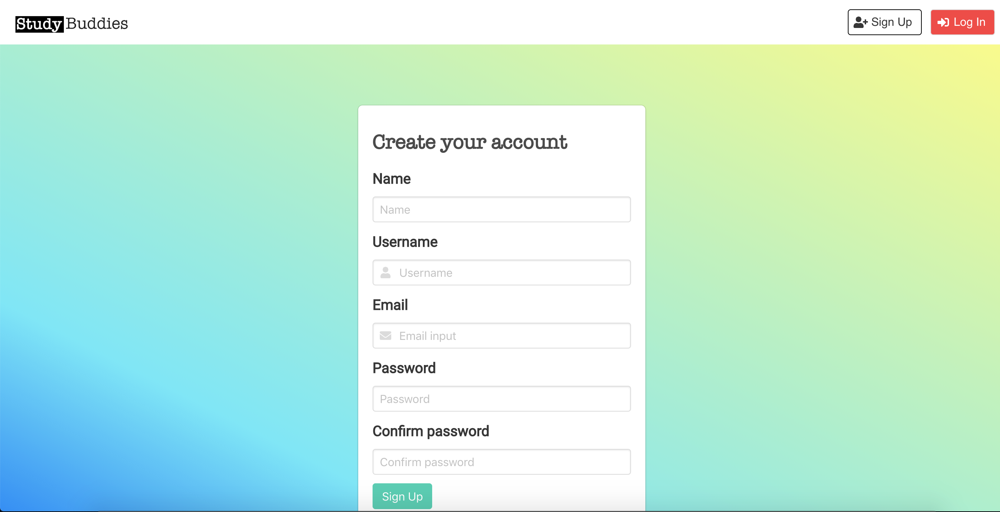
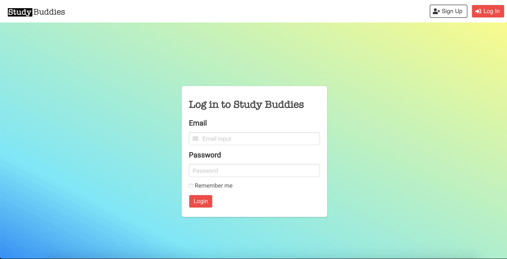
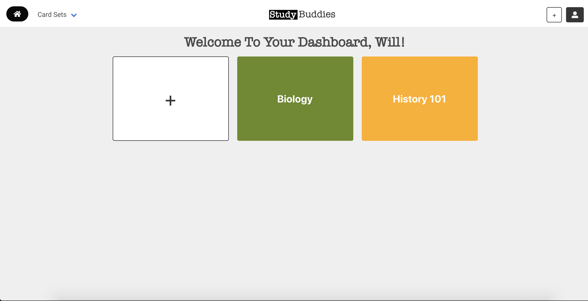
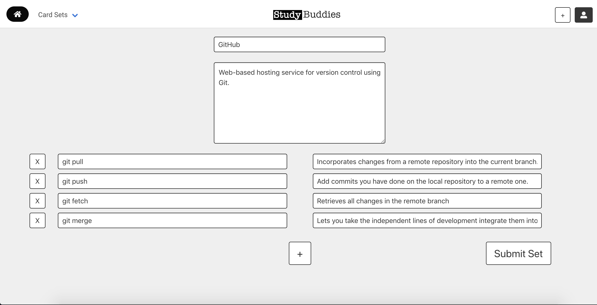
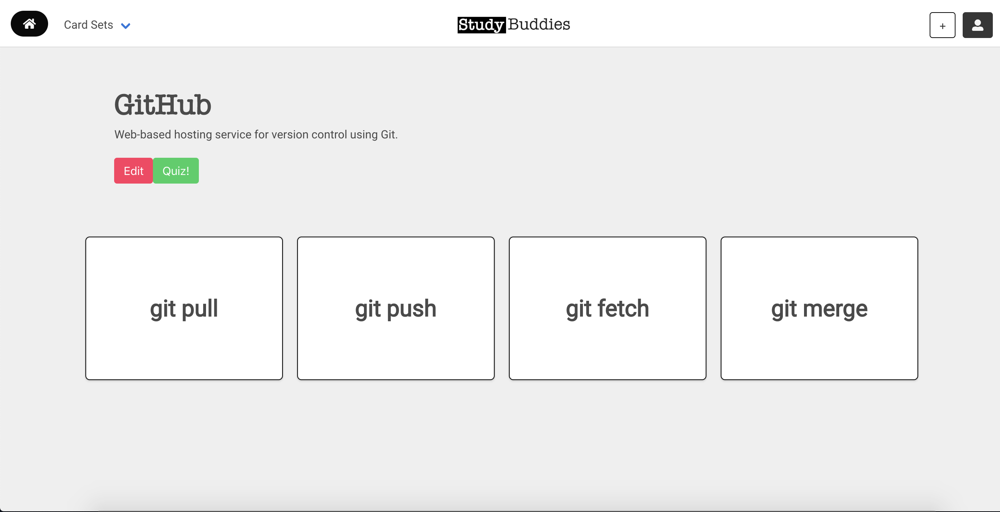
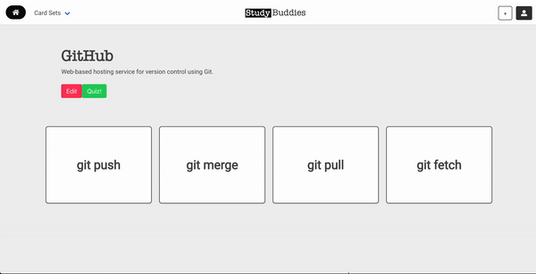
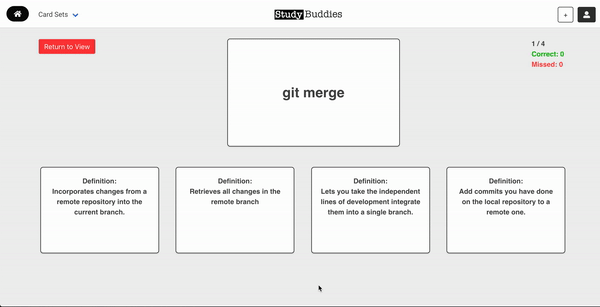

# Study Buddies

Study Buddies is a web application that allows users to create, study, and quiz themselves on flashcards.

## Table of Contents

- [Getting Started](#getting-started)
- [Prerequisites](#prerequisites)
- [Downloading The Project](#downloading-the-project)
- [Setting Up The Front End](#setting-up-the-frontend)
- [Running The Project](#running-the-project)
- [Built With](#built-with)
- [Authors](#authors)
- [Contributors](#contributors)
- [Similar Projects](#similar-projects)

## Getting Started

These instructions will get you a copy of the project up and running on your local machine for development and testing purposes. 

### Prerequisites

In order to run this project, you need to have [Node.js](https://nodejs.org/en/) installed. To tell if you have it installed, open your Command Line/Terminal and type the following:

```
$ node -v
v10.x.x
```

### Downloading The Project

To begin setting up the project, either download the project by clicking [here](https://github.com/m1771vw/StudyBuddies/archive/master.zip) or by cloning the project: 

```
$ git clone https://github.com/m1771vw/StudyBuddies
$ cd StudyBuddies
```

### Setting Up The Front End

Navigate to the root of the project folder and run `npm install`:
```
$ npm install
```
After the dependencies have been installed, you can start the project.

### Running The Project

To run the project, you will need to be in the `StudyBuddies` directory. 

Run `npm start`.

To confirm the frontend has started, you should be greeted with this screen.

<p align="center">
  
</p>

## Using Study Buddies

To login, first make an account by pressing the **Sign Up** button in the top right corner of the header, or the **Sign up for free** button on the home page.

<p align="center">
  
</p>

After making an account, it should re-direct you to the login page.

<p align="center">
  
</p>

If you logged in successfully, you will be re-directed to the dashboard. You should see some pre-seeded data on the dashboard.

<p align="center">
  
</p>

You can press on the white + cardset to **create** a new cardset. Add the title of the cardset, description, and the card terms and definitions as necessary. If you are adding more than 4, you can press the **+** to add more rows. Once you're finished, pressed Submit Set.

<p align="center">
  
</p>

After creating a cardset, it will redirect you to the **cardset details** page.

<p align="center">
  
</p>

Here, you can study the cards by hovering over them to see the definition to the term.

<p align="center">
  
</p>

You can press the **Quiz** button to quiz yourself on your cards.

<p align="center">
  
</p>

## Built With

* [React.js](https://reactjs.org/) 
* [Bulma](https://bulma.io/)

## Authors

* **William Yang** - *Initial work* - [m1771vw](https://github.com/m1771vw)
* **James Park**   - *Initial work* - [jaamz](https://github.com/jaamz)

## Contributors

You can look here for a list of [contributors](https://github.com/m1771vw/StudyBuddies/graphs/contributors) for the project.

## Similar Projects

* [Study Buddies Mobile](https://github.com/m1771vw/StudyBuddiesMobile)